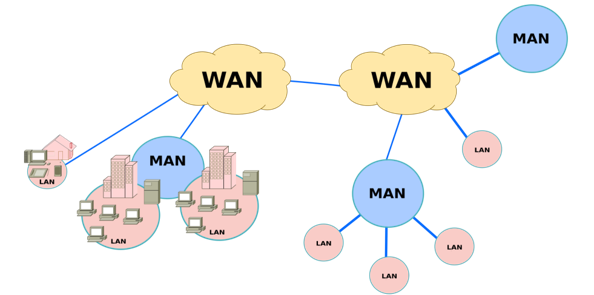

# UD1-Introducció a les xarxes locals

RA1. Reconeix l'estructura de xarxes locals cablejades analitzant-ne les característiques d'entorns d'aplicació i descrivint-ne la funcionalitat dels seus components.

Criteris d'avaluació:

1.1 Descriu els principis de funcionament de les xarxes locals.
1.2 Identifica els diferents tipus de xarxes.
1.3 Descriu els elements de la xarxa local i la seva funció.
1.4 Identifica i classifica els mitjans de transmissió.
1.5 Reconeix el mapa físic de la xarxa local.
1.6 Utilitza aplicacions per representar el mapa físic de la xarxa local.
1.7 Reconeix les diferents topologies de xarxa.
1.8 Identifica estructures alternatives.

## 1. Xarxes de computadors

Conjunt de dos o més equips informàtics, no cal que siguin els típics ordinadors que teniu en ment, poden ser mòbils, impressores, smartTV, etc. connectats entre sí per proporcionar:

- Comunicació (enviament missatges)
- Compartir recursos (baixar arxius de la Comuna)
- Compartir informació (treballeu sobre el mateix document de text).

### Antecedents històrics

Els primers ordinadors (ENIAC, UNIVAC, etc.) eren molt grans i a més es trobaven aillats. Si calia compartir informació entre ells, calia fer-ho mitjançant dispostius d'emmagatzematge externs: al principi targetes perforades, després cintes magnètiques i finalment discs durs.

>Imatge 1: Unitats de cinta IBM 2401 al Computer History Museum. Atribució: <a href="https://commons.wikimedia.org/wiki/File:IBM_2401_tape_drives_at_the_Computer_History_Museum.jpg">Don DeBold</a>, <a href="https://creativecommons.org/licenses/by/2.0">CC BY 2.0</a>, via Wikimedia Commons

Posteriorment, es va veure la necessitat de connectar directament els ordinadors entre ells. I com es podia fer? Doncs aprofitant les línies de telèfon que ja existien. Els ordinadors *parlaven* fent-se una trucada telefònica. Per aconseguir això, calia un dispositiu que convertís els senyals digitals de l'ordinador en senyals analògics que poguessin viatjar per la línia telefònica. Aquest dispositiu es coneix com a *modem* (modulador-demodulador).

> Imatge 2: Atari 800XL amb un modem. Atribució: <a href="https://commons.wikimedia.org/wiki/File:Atari_800XL_with_Modem.jpg">Wikimedia Commons</a>, <a href="https://creativecommons.org/licenses/by-sa/4.0/deed.en">CC BY-SA 4.0</a>, via Wikimedia Commons

Això era una forma molt limitada, de manera que a Estats Units a la dècada dels 60 es va dissenyar un sistema de xarxa de computadors que permetia connectar diversos ordinadors entre ells. Aquest sistema es va batejar com ARPANET i va ser el precursor de l'Internet actual.

> ARPANET (Advanced Research Projects Agency Network) era una xarxa de comunicacions que va ser creada per l'Agència de Projectes de Recerca Avançada del Departament de Defensa dels Estats Units (ARPA) i va fer la primera transmissió de dades entre ordinadors el 29 d'octubre de 1969 entre UCLA i Stanford.

### Classificació de les xarxes

A l’hora de classificar les xarxes podem usar diversos criteris, un d’habitual és la mida de la xarxa, és a dir, ens fixarem en quina extensió geogràfica està coberta per la xarxa. Aquesta classificació és significativa, perquè la mida de la xarxa determina aspectes claus de la tecnologia de la xarxa.

Atenent a la mida de la xarxa, podem distingir:

- **Xarxes d’àrea personal** (PAN, Personal Area Network): són xarxes que cobreixen un espai molt reduït, com ara una habitació. Normalment connecten dispositius personals com ara ordinadors portàtils, telèfons mòbils, impressores i altres dispositius electrònics. Un exemple de PAN és la connexió Bluetooth entre un telèfon i uns auriculars sense fils.

- **Xarxes d’àrea local** (LAN, Local Area Network): són xarxes que cobreixen un espai més gran, com ara una oficina, un edifici o un campus universitari. Les LAN permeten la connexió de diversos dispositius dins d’una àrea geogràfica limitada i ofereixen una alta velocitat de transmissió de dades. Un exemple de LAN és la xarxa dels ordinadors de l'escola. Un aspecte fonamental, és que la **infraestructura de la LAN és propietat de l’organització que la gestiona**, i per tant, és responsable del seu manteniment i seguretat.

- **Xarxes d’àrea metropolitana** (MAN, Metropolitan Area Network): són xarxes que cobreixen una àrea més extensa, com ara una ciutat o una regió metropolitana.

- **Xarxes d’àrea extensa** (WAN, Wide Area Network): són xarxes que cobreixen una àrea geogràfica molt gran, com ara un país o fins i tot el món sencer. Les WAN permeten la connexió de xarxes LAN i MAN a través de línies de comunicació de llarga distància, com ara cables de fibra òptica, satèl·lits o connexions de telefonia. Aquestes xarxes són **d'ús públic i compartit**, és a dir, els seus propietaris, per exemple Movistar, Vodafone, Orange, etc., ofereixen l'ús de les xarxes a canvi d'un pagament. Internet és una xarxa WAN que connecta milers de milions de dispositius arreu del món.

> Imatge 3: Xarxes segons la seva mida. Atribució: Miguel Carrillo Martínez sota llicència [CC BY-SA 4.0](https://creativecommons.org/licenses/by-sa/4.0/deed.en)

### Topologies de xarxa

Topologia és la manera com els dispositius d’una xarxa estan connectats entre si. La topologia determina com es comuniquen els dispositius, com es transmeten les dades i com es gestiona la xarxa. Hi ha diverses topologies de xarxa, cadascuna amb les seves característiques i avantatges.
