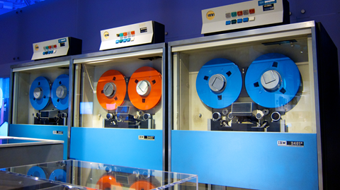
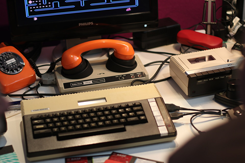
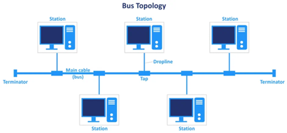
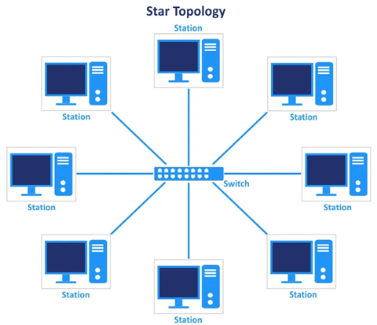
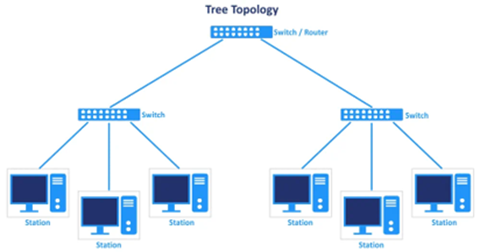
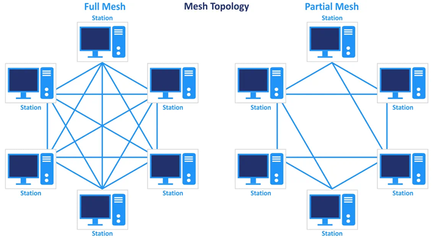
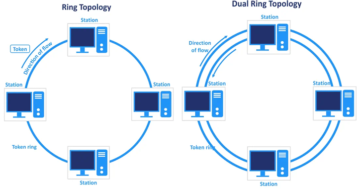
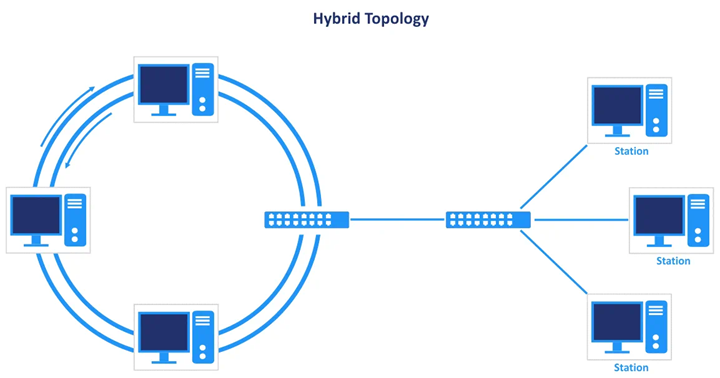
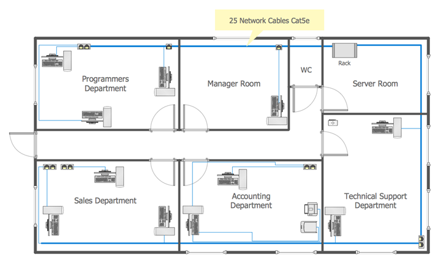

# UD1-Introducció a les xarxes locals

RA1. Reconeix l'estructura de xarxes locals cablejades analitzant-ne les característiques d'entorns d'aplicació i descrivint-ne la funcionalitat dels seus components.

Criteris d'avaluació:

1.1 Descriu els principis de funcionament de les xarxes locals.
1.2 Identifica els diferents tipus de xarxes.
1.3 Descriu els elements de la xarxa local i la seva funció.
1.4 Identifica i classifica els mitjans de transmissió.
1.5 Reconeix el mapa físic de la xarxa local.
1.6 Utilitza aplicacions per representar el mapa físic de la xarxa local.
1.7 Reconeix les diferents topologies de xarxa.
1.8 Identifica estructures alternatives.

## Xarxes de computadors

Conjunt de dos o més equips informàtics, no cal que siguin els típics ordinadors que teniu en ment, poden ser mòbils, impressores, smartTV, etc. connectats entre sí per proporcionar:

- Comunicació (enviament missatges)
- Compartir recursos (baixar arxius de la Comuna)
- Compartir informació (treballeu sobre el mateix document de text).

### Antecedents històrics

Els primers ordinadors (ENIAC, UNIVAC, etc.) eren molt grans i a més es trobaven aillats. Si calia compartir informació entre ells, calia fer-ho mitjançant dispostius d'emmagatzematge externs: al principi targetes perforades, després cintes magnètiques i finalment discs durs.

>Imatge 1: Unitats de cinta IBM 2401 al Computer History Museum. Atribució: <a href="https://commons.wikimedia.org/wiki/File:IBM_2401_tape_drives_at_the_Computer_History_Museum.jpg">Don DeBold</a>, <a href="https://creativecommons.org/licenses/by/2.0">CC BY 2.0</a>, via Wikimedia Commons

Posteriorment, es va veure la necessitat de connectar directament els ordinadors entre ells. I com es podia fer? Doncs aprofitant les línies de telèfon que ja existien. Els ordinadors *parlaven* fent-se una trucada telefònica. Per aconseguir això, calia un dispositiu que convertís els senyals digitals de l'ordinador en senyals analògics que poguessin viatjar per la línia telefònica. Aquest dispositiu es coneix com a *modem* (modulador-demodulador).

> Imatge 2: Atari 800XL amb un modem. Atribució: <a href="https://commons.wikimedia.org/wiki/File:Atari_800XL_with_Modem.jpg">Wikimedia Commons</a>, <a href="https://creativecommons.org/licenses/by-sa/4.0/deed.en">CC BY-SA 4.0</a>, via Wikimedia Commons

Això era una forma molt limitada, de manera que a Estats Units a la dècada dels 60 es va dissenyar un sistema de xarxa de computadors que permetia connectar diversos ordinadors entre ells. Aquest sistema es va batejar com ARPANET i va ser el precursor de l'Internet actual.

> 💡ARPANET (Advanced Research Projects Agency Network) era una xarxa de comunicacions que va ser creada per l'Agència de Projectes de Recerca Avançada del Departament de Defensa dels Estats Units (ARPA) i va fer la primera transmissió de dades entre ordinadors el 29 d'octubre de 1969 entre UCLA i Stanford.

## Classificació de les xarxes

A l’hora de classificar les xarxes podem usar diversos criteris, un d’habitual és la mida de la xarxa, és a dir, ens fixarem en quina extensió geogràfica està coberta per la xarxa. Aquesta classificació és significativa, perquè la mida de la xarxa determina aspectes claus de la tecnologia de la xarxa.

Atenent a la mida de la xarxa, podem distingir:

- **Xarxes d’àrea personal** (PAN, Personal Area Network): són xarxes que cobreixen un espai molt reduït, com ara una habitació. Normalment connecten dispositius personals com ara ordinadors portàtils, telèfons mòbils, impressores i altres dispositius electrònics. Un exemple de PAN és la connexió Bluetooth entre un telèfon i uns auriculars sense fils.

- **Xarxes d’àrea local** (LAN, Local Area Network): són xarxes que cobreixen un espai més gran, com ara una oficina, un edifici o un campus universitari. Les LAN permeten la connexió de diversos dispositius dins d’una àrea geogràfica limitada i ofereixen una alta velocitat de transmissió de dades. Un exemple de LAN és la xarxa dels ordinadors de l'escola. Un aspecte fonamental, és que la **infraestructura de la LAN és propietat de l’organització que la gestiona**, i per tant, és responsable del seu manteniment i seguretat.

- **Xarxes d’àrea metropolitana** (MAN, Metropolitan Area Network): són xarxes que cobreixen una àrea més extensa, com ara una ciutat o una regió metropolitana.

- **Xarxes d’àrea extensa** (WAN, Wide Area Network): són xarxes que cobreixen una àrea geogràfica molt gran, com ara un país o fins i tot el món sencer. Les WAN permeten la connexió de xarxes LAN i MAN a través de línies de comunicació de llarga distància, com ara cables de fibra òptica, satèl·lits o connexions de telefonia. Aquestes xarxes són **d'ús públic i compartit**, és a dir, els seus propietaris, per exemple Movistar, Vodafone, Orange, etc., ofereixen l'ús de les xarxes a canvi d'un pagament. Internet és una xarxa WAN que connecta milers de milions de dispositius arreu del món.

> Imatge 3: Xarxes segons la seva mida. Atribució: Miguel Carrillo Martínez sota llicència [CC BY-SA 4.0](https://creativecommons.org/licenses/by-sa/4.0/deed.en)

Aquest mòdul se centra específicament en les xarxes d’àrea local (LAN) i per tant, a partir d’ara, quan parlem de xarxa, ens referirem a una xarxa local (LAN).

## Topologies de xarxa

Topologia és la manera com els dispositius d’una xarxa estan connectats entre si. La topologia determina com es comuniquen els dispositius, com es transmeten les dades i com es gestiona la xarxa. Hi ha diverses topologies de xarxa, cadascuna amb les seves característiques i avantatges.

- **Topologia en bus**: tots els dispositius estan connectats a un únic canal de comunicació central, anomenat bus. Les dades viatgen en ambdues direccions pel bus i cada dispositiu escolta les dades que passen pel bus. Originalment, les xarxes d'ordinadors usaven aquesta tecnologia, però avui dia no s'utilitza en xarxes cablejades.

   
   > Imatge 4: Topologia en bus. Atribució: [Nakivo](https://www.nakivo.com/blog/types-of-network-topology-explained/)

- **Topologia en estrella**: tots els dispositius estan connectats a un dispositiu central, anomenat concentrador o switch. Les dades viatgen des del dispositiu emissor fins al dispositiu central, que les envia al dispositiu receptor. Aquesta topologia és la més utilitzada en xarxes LAN cablejades.

   
   > Imatge 5: Topologia en estrella. Atribució: [Nakivo](https://www.nakivo.com/blog/types-of-network-topology-explained/)

- **Topologia en arbre**: És una estructura jeràrquica que permet connectar diverses xarxes més petites.
És la topologia d’una xarxa d’edifici (exemple l’escola) on cada xarxa local (aula) és una estrella i s’uneixen a una xarxa en arbre que les connecta entre sí i a Internet.

   
   > Imatge 6: Topologia en arbre. Atribució: [Nakivo](https://www.nakivo.com/blog/types-of-network-topology-explained/)

- **Malles**: En aquesta topologia, cada dispositiu està connectat a diversos altres dispositius, creant una xarxa de connexions múltiples. Això proporciona redundància i millora la fiabilitat de la xarxa, ja que si una connexió falla, les dades poden trobar un altre camí per arribar al seu destí. Aquesta topologia és més complexa i costosa de implementar, però és molt utilitzada en xarxes WAN i en entorns on la disponibilitat és crítica. En entorns amb pocs nodes i on la fiabilitat és important, es pot utilitzar una topologia en malla completa, on cada dispositiu està connectat a tots els altres dispositius de la xarxa. En entorns amb molts nodes, es pot utilitzar una topologia en malla parcial, on només alguns dispositius estan connectats entre sí, per oferir múltiples camins.

   
   > Imatge 7: Topologia en malla. Atribució: [Nakivo](https://www.nakivo.com/blog/types-of-network-topology-explained/)

- **Topologia en anell**: En aquesta topologia, els dispositius estan connectats en un cercle tancat, de manera que cada dispositiu té dos veïns. Les dades viatgen en sol sentit al llarg de l’anell fins que arriben al dispositiu receptor. Aquesta topologia va ser popular en les primeres xarxes LAN (com Token Ring), però avui dia és menys utilitzada. Hi ha una variant d’aquesta topologia, anomenada *topologia en anell doble*, on les dades poden viatjar en ambdos sentits, millorant la fiabilitat de la xarxa.

   
   > Imatge 8: Topologia en anell. Atribució: [Nakivo](https://www.nakivo.com/blog/types-of-network-topology-explained/)

- **Topologia híbrida**: És una combinació de dues o més topologies bàsiques. Per exemple, una organització pot tenir una topologia d'anell doble (era relativament habitual en clusters de servidors) i una topologia en estrella per connectar els ordinadors dels usuaris. Aquesta combinació permet aprofitar els avantatges de cada topologia i adaptar-se a les necessitats específiques de la xarxa.
  
     
   > Imatge 9: Topologia híbrida. Atribució: [Nakivo](https://www.nakivo.com/blog/types-of-network-topology-explained/)

## Elements d’una xarxa local

Una xarxa local està formada per diversos elements que treballen conjuntament per permetre la comunicació i el compartiment de recursos entre els dispositius connectats. A continuació, es descriuen els principals components d’una xarxa local:

- **Dispositius finals**: Són els dispositius que utilitzen els usuaris per accedir a la xarxa i als seus recursos. Aquests poden incloure ordinadors, portàtils, telèfons mòbils, tauletes, impressores, càmeres de seguretat, entre altres. Aquests dispositius són els que generen i reben dades dins de la xarxa.
- **Dispositius de xarxa**: Són els dispositius que faciliten la comunicació entre els dispositius finals i gestionen el trànsit de dades dins de la xarxa. Alguns exemples inclouen el switch, el router o el punt d'accés sense fils (AP). Aquests dispositius permeten la connexió i la transmissió de dades entre els dispositius finals i altres xarxes, com ara Internet.
- **Mitjans de transmissió**: Són els canals físics o sense fils a través dels quals es transmeten les dades entre els dispositius de la xarxa. Aquests poden ser cables o connexions sense fils, com ara Wi-Fi o Bluetooth. Els mitjans de transmissió determinen la velocitat i la qualitat de la comunicació dins de la xarxa.
- **Protocols de comunicació**: Són les regles i estàndards que defineixen com es transmeten les dades dins de la xarxa. Aquests protocols asseguren que els dispositius puguin entendre's entre si i permeten la interoperabilitat entre diferents fabricants i tecnologies.

## Mapa físic de la xarxa local

S'utilitza per representar la ubicació dels dispositius i el cablejat de xarxa dins d'un edifici. Per tant, aquest diagrama haurà de mostrar:

- Dispositius connectats.
- Rutes del cable (canalitzacions).

És una eina molt important pel manteniment d’una xarxa local, perquè permet localitzar els diferents equips i conèixer les rutes que segueix el cablejat. Això simplifica molt la tasca de localitzar i resoldre problemes de connexió, així com planificar ampliacions o modificacions en la xarxa.

> Imatge 10: Exemple de mapa físic d’una xarxa local. Atribució: [visaletterapplication.com](https://visalettersapplication.com)

### Com crear un mapa físic de la xarxa local

El primer pas és recopilar la informació (localització equips, conductes, etc.) A continuació usar una eina de disseny per elaborar un plànol de la planta on es troba la xarxa. Es poden usar eines com: **Microsoft Visio**, **LucidChart**, etc. En aquest pas, s'ubiquen els diferents elements (ordinadors, impressores, etc.) i les conduccions del cable.

Com veurem a les properes unitats, el cablejat de xarxa acaba convergint cap un element on es troben els concentradors i altres elements de la xarxa, anomenat repartidor.
