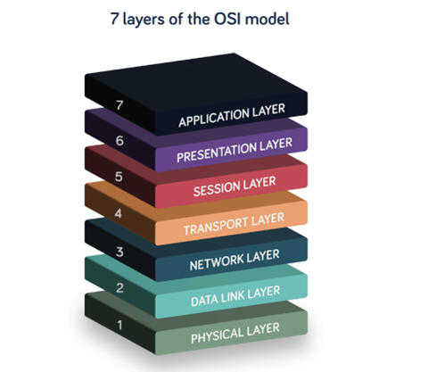
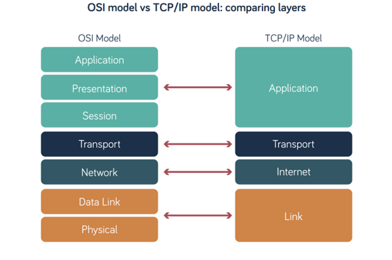

# UD2-Arquitectura de xarxes

RA1. Reconeix l'estructura de xarxes locals cablejades analitzant-ne les característiques d'entorns d'aplicació i descrivint-ne la funcionalitat dels seus components.

## El protocols

A la unitat anterior hem vist que els protocols són un conjunt de regles i estàndards que defineixen com es transmeten les dades dins de la xarxa. Aquests protocols asseguren que els dispositius puguin entendre's entre si i permeten la interoperabilitat entre diferents fabricants i tecnologies.

Això vol dir que els protocols defineixen els diferents aspectes, tant des del punt de vista físic: tipus de connector, tensions de treball, freqüències, com des del punt de vista lògic: com s'organitzen les dades, com es detecten i corregeixen errors, com es gestiona el flux d'informació, etc.

### Model de capes

És evident que amb tants aspectes a considerar i que tenen relació entre sí, els protocols poden ser extremadament complicats de crear i evolucionar. Per això, s'utilitza un **model de capes** que permet dividir la complexitat del sistema en diferents capes, on cada capa té una funció específica i es comunica amb les capes adjacents. D'aquesta manera, es poden desenvolupar protocols de manera més senzilla i modular.

> 💡Per entendre una mica millor aquesta idea, penseu com organitzaríau la comunicació al següent escenari: "dos pintors de finals del s.XIX, un de francès que viu a Londres i un de rus, que viu a Nova York, volen intercanviar opinions i idees sobre pintura usant el telègraf. Cap d'ells parla més que el seu idioma natal i els telegrafistes només accepten missatges en anglès".

El principi de funcionament d'un model per capes és força senzill:

- Cada capa té una funció específica i es comunica amb les capes adjacents.
- Cada capa només coneix la seva pròpia funció i no té coneixement de les funcions de les altres capes.
- Cada capa utilitza els serveis de la capa inferior i ofereix serveis a la capa superior.
- Cada capa pot ser desenvolupada i modificada de manera independent, sempre que es mantingui la interfície amb les capes adjacents.

Al conjunt de protocols que operen a tots els nivells de l'arquitectura de xarxa se l'anomena **pila de protocols**. Els dos models més importants són el model OSI (Open Systems Interconnection) i el model TCP/IP (Transmission Control Protocol/Internet Protocol).

#### Model de referència OSI

És un model teòric, és a dir, no és un model real que s'implementi en la pràctica, però serveix com a referència per entendre i analitzar el funcionament de les xarxes. Va ser definit entre 1977 i 1984 per la ISO (International Standards Organization) per promoure la creació d'estàndards de fabricant independents.

Defineix 7 capes, la més baixa relacionada amb aspectes físics, la més alta relacionada amb la interacció amb els usuaris.

- **Capa física**: defineix les característiques elèctriques, mecàniques i funcionals per activar, mantenir i desactivar la connexió física entre sistemes finals. Aquesta capa s'encarrega de la transmissió de bits a través d'un medi físic.
- **Capa de connexió de dades o enllaç**: proporciona la transferència fiable de dades entre dos nodes connectats directament. Aquesta capa s'encarrega de la detecció i correcció d'errors, així com del control del flux de dades.
- **Capa de xarxa**: s'encarrega de determinar la ruta que les dades han de seguir per arribar al seu destí. Aquesta capa s'ocupa de l'adreçament i encaminament dels paquets de dades.
- **Capa de transport**: proporciona la transferència fiable de dades entre sistemes finals. Aquesta capa s'encarrega de la segmentació i reassemblatge de les dades, així com del control de flux i la detecció d'errors.
- **Capa de sessió**: estableix, gestiona i finalitza les connexions entre aplicacions. Aquesta capa s'encarrega de la sincronització i control de diàlegs entre aplicacions.
- **Capa de presentació**: s'encarrega de la representació de les dades, la codificació i la compressió. Aquesta capa assegura que les dades siguin comprensibles per les aplicacions.
- **Capa d'aplicació**: proporciona serveis de xarxa directament a les aplicacions dels usuaris. Aquesta capa s'encarrega de la interacció amb els usuaris i de proporcionar serveis com el correu electrònic, la transferència de fitxers i la navegació web.

> Model de referència OSI. Atribució: [Neos Networks](https://neosnetworks.com/resources/blog/what-is-osi-model/)

A cada capa, el PDU (“Protocol Data Unit”) o unitat de dades del protocol té un nom i una mida específica (bit, trama, paquet, segment, etc). Cada capa afegeix una capçalera al seu PDU, que conté informació de control i gestió necessària per a la seva funció.

Una capa empaqueta el PDU de la capa superior dins del seu propi, sense modificar-lo, és el que s'anomena **encapsulació de les dades**.

> 💡Podeu pensar fent una analogia a com funciona quan compreu un producte a una plataforma online: el producte s'empaqueta a una caixa o sobre, que al seu torn s'empaqueta dins d'una altra caixa més gran (agrupant paquets per província), aquestes caixes es fiquen dins un contenidor, i aquest contenidor es transporta, per exemple, en vaixell fins al port de destinació, on es descarrega, un cop a l'agència, el contenidor s'obre i les diferents caixes s'envien a les diferents agències provincials, on s'obren les caixes i es reparteixen els paquets als usuaris que, finalment, obren el paquet i poden gaudir del producte que han comprat.

#### Pila de protocols TCP/IP

Aquesta pila de protocols sí que és d'ús real, ja que és la que s'utilitza a Internet i s'ha convertit en l'estàndard de facto per a la comunicació entre xarxes. Va ser desenvolupada a principis dels anys 70 per DARPA (Defense Advanced Research Projects Agency) i es basa en un model de 4 capes:

- **Capa d'accés a la xarxa**: combina les funcions de les capes física i de connexió de dades del model OSI. Aquesta capa s'encarrega de la transmissió de bits a través d'un medi físic i de la detecció i correcció d'errors.
- **Capa d'internet**: s'encarrega de l'adreçament i encaminament dels paquets de dades. Aquesta capa utilitza el protocol IP (Internet Protocol) per identificar els dispositius a la xarxa i determinar la ruta que les dades han de seguir.
- **Capa de transport**: proporciona la transferència fiable de dades entre sistemes finals. Aquesta capa utilitza protocols com TCP (Transmission Control Protocol) i UDP (User Datagram Protocol) per gestionar la segmentació i reassemblatge de les dades, així com el control de flux i la detecció d'errors.
- **Capa d'aplicació**: proporciona serveis de xarxa directament a les aplicacions dels usuaris. Aquesta capa inclou protocols com HTTP (Hypertext Transfer Protocol), FTP (File Transfer Protocol), SMTP (Simple Mail Transfer Protocol) i DNS (Domain Name System), entre altres.

> Comparativa entre el model OSI i el model TCP/IP. Atribució: [Neos Networks](https://neosnetworks.com/resources/blog/what-is-osi-model/)

#### Altres famílies de protocols

Tot i que el model TCP/IP és el més utilitzat, i s'ha acabat imposant a tota la resta (no seguir-lo implicaria incompatibilitat amb Internet), no detalla els protocols de la capa d'accés a la xarxa, de manera que existeixen diferents piles de protocols que defineixen els protocols a nivell físic (capa 1 OSI) i de connexió de dades (capa 2 OSI). Alguns dels més importants són:

- **Ethernet IEEE 802.3**: és la tecnologia de xarxa local més utilitzada actualment.

- **Wi-Fi IEEE 802.11**: conjunt de protocols per a xarxes sense fils, que permeten la connexió de dispositius a Internet i a xarxes locals sense necessitat de cables.

Altres piles de protocols com Token Ring, AppleTalk o Novell IPX/SPX han quedat obsoletes i ja no s'utilitzen en entorns de xarxa moderns.
