# UD3. Elements d’una xarxa local

RA2. Desplega el cablejat d'una xarxa local interpretant-ne especificacions i aplicant-hi tècniques de muntatge.

## Conceptes previs: transmissió de dades

Quan parlem de transmissió en el món de les xarxes locals, un punt important és saber com es realitza aquesta transmissió des del punt de vista de l’emissor i el receptor.

Tenint en compte la direcció de la transmissió, podem distingir tres tipus de transmissió:

-**Símplex**: les dades viatgen en un sol sentit. És a dir, hi ha un únic emissor. Exemple: la TV.
-**Half dúplex**: la informació viatja en els dos sentits, però de manera alternativa. Exemple: els walkie.
-**Full dúplex**: les dades s’envien en els dos sentits i de forma simultània. Exemple: telèfon.

Un altre aspecte a tenir en compte és com es mesura la velocitat de transmissió de dades. Aquesta velocitat es mesura indicant el cabal de **bits per segon (bps)**. Per aquesta unitat, s'utilitzen els prefixos del Sistema Internacional, com ara Kbps (kilobits per segon), Mbps (megabits per segon) o Gbps (gigabits per segon), que corresponen a potències de 10 (10^3, 10^6 i 10^9, respectivament). Per exemple, una connexió a Internet de 100 Mbps significa que es poden transmetre fins a 100 milions de bits per segon.

> ⚠️ **Alerta**: quan es parla de la informació i l'emmagatzematge de dades (RAM, fitxers, etc.) la unitat bàsica és el **byte** (8 bits) i els múltiples d’aquesta unitat són el KB (kilobyte), MB (megabyte), GB(gigabyte),TB (terabyte), etc. Però en aquest cas, aquests prefixos es refereixen a potències de 2 (2^10, 2^20, 2^30, 2^40, etc.). Per exemple, un fitxer de 1 KB té una mida de 1024 bytes (2^10) i un 1 MB té una mida de 1.048.576 bytes (2^20) o 1024 KB (1024*1024 bytes).

## Xarxes locals cablejades: Ethernet

Desenvolupada per Xerox a la dècada del 1970. Actualment és l’estàndard de facto de les xarxes locals amb cable i es troba recollit en l’estàndard IEEE 802.3, tot i que encara se sol anomenar simplement Ethernet. Aquest estàndard defineix els aspectes de les capes 1 i 2 del model OSI (xarxa local).

Originàriament Ethernet oferia una velocitat de 10 Mbps en xarxes amb bus, però posteriorment va evolucionar a un model d'estrella amb commutadors.

Versions actuals:

- 1 GB Ethernet a 1 Gbps. Entorns xarxes locals
- 10G Ethernet a 10 Gbps. És la versió recomanada per xarxes locals noves.
- 100 G Ethernet per centres de dades.
- 400G i 800 G únicament amb fibra òptica. Reservat per superordinadors, centres de dades de nova generació, etc.

Ethernet pot usar cables de parells o fibra òptica com a mitjans de transmissió.

### Capa enllaç a Ethernet

La capa enllaç a Ethernet defineix com es gestionen les comunicacions a nivell de xarxa local. Aquesta capa s'encarrega de la transmissió de paquets entre dispositius d'una mateixa xarxa local, assegurant que els paquets arribin correctament al destinatari. Aquesta capa també gestiona la detecció i correcció d'errors, així com la gestió del trànsit de la xarxa.

#### Adreces MAC

Les tecnologies de xarxa local utilitzen l’anomenada adreça física o **MAC (Medium Acces Control)** per identificar els equips.

Aquesta adreça té 48 bits:

- 24 primers identifiquen fabricant
- 24 següents identifiquen l’equip

Es representa en format hexadecimal: 00:30:1b:b7:cd:b6

És una adreça **única** que es registra al hardware de l’adaptador. Un equip té una adreça MAC per cada adaptador de xarxa que tingui.

#### Control del mitjà

Ethernet és una xarxa anomenada de **difusió**, això vol dir que els equips no fan torns per escriure a la xarxa, això implica que hi ha competició pel medi.

En ser originàriament en bus, es produïen col·lisions quan dos equips escrivien simultàniament.

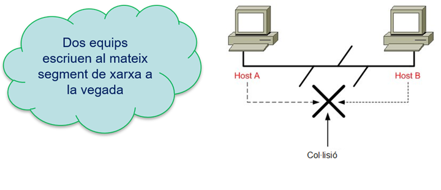

Per solucionar aquest problema, s’utilitza un protocol anomenat **CSMA/CD (Carrier Sense Multiple Access with Collision Detection)**. Aquest protocol permet que els dispositius escoltin el medi abans d’enviar dades i detectin col·lisions quan es produeixen. El seu funcionament es basa en els següents passos:

- Abans d’escriure l’equip mira que la xarxa estigui lliure.
- Si un equip detecta una col·lisió s'aturaven tots els enviaments i esperaven un temps aleatori abans de tornar a intentar enviar les dades.

Quan es va passar de la topologia de bus a la d'estrella, els primers concentradors (hubs) no evitaven les col·lisions, perquè enviaven les dades a tots els ports (replicaven el funcionament d'un bus), de manera que tota la xarxa local era un únic domini de col·lisions.

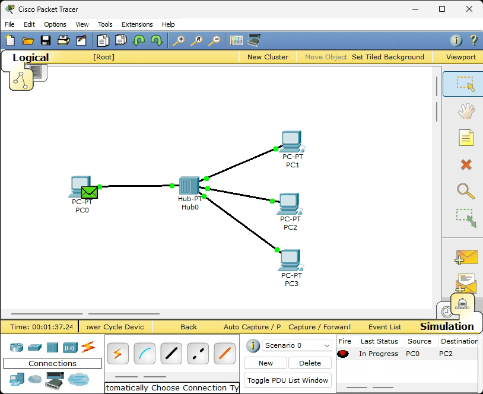

Posteriorment, els hubs es van substituir per commutadors (switch) que només enviaven les dades al port destinatari, de manera el domini de col·lisions es reduïa a un únic port (entre el switch i el dispositiu), i per tant, les col·lisions es van reduir molt.

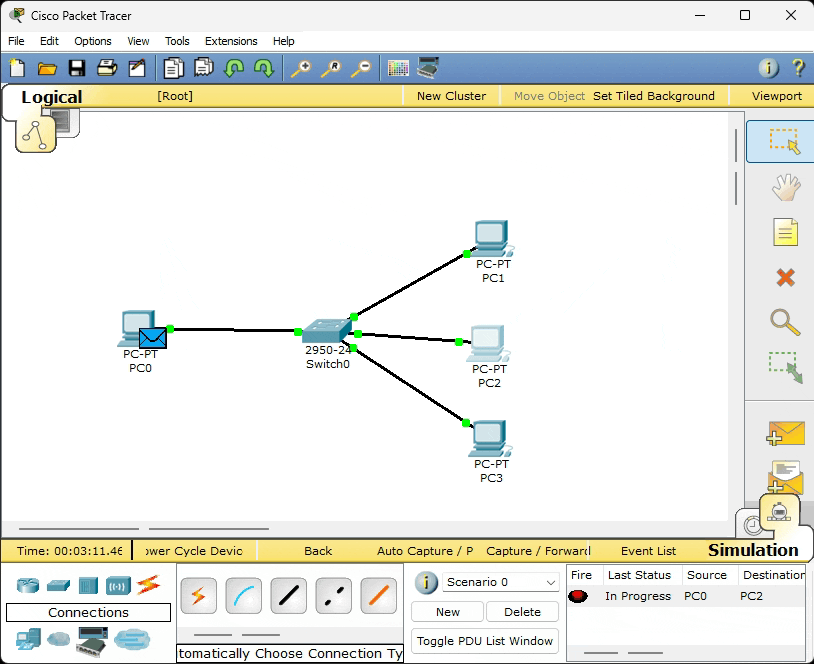

Finalment, Ethernet va passar a un model de transmissió full dúplex, de manera que no hi ha possibilitat de col·lisions. Per aquest motiu, actualment el CSMA/CD ve deshabilitat per defecte.

### Trama o frame

És la unitat de transmissió (PDU) a nivell de capa enllaç. Conté la informació que es vol transmetre i la informació de control necessària per assegurar que el paquet arribi correctament al seu destí. La trama té les característiques següents:

- Longitud variable, però amb un mínim de 64 bytes i un màxim de 1518 bytes.
- Conté un camp de dades que pot tenir una mida màxima de 1500 bytes i un mínim de 46 bytes. Si la informació a transmetre és menor de 46 bytes, s’afegeixen bytes de farciment (padding) per arribar al mínim de 46 bytes.
- El preàmbul és un camp de 7 bytes que s’utilitza per sincronitzar la transmissió de dades entre l’emissor i el receptor.
- Conté els camps d’adreça MAC de l’emissor i del receptor, que permeten identificar els dispositius que participen en la comunicació.
- Els camps de tipus i longitud indiquen el tipus de dades que s’estan transmetent i la longitud del camp de dades real (excloent el farciment).
- La trama conté un camp de control d’errors (FCS, Frame Check Sequence) que permet detectar errors en la transmissió de dades. Aquest camp utilitza un algorisme de detecció d’errors anomenat CRC (Cyclic Redundancy Check).

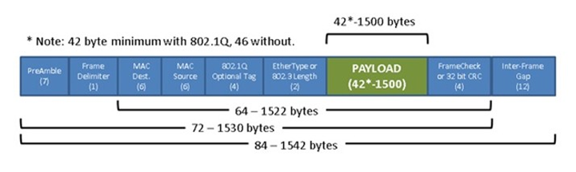

## Elements xarxa local

Una xarxa local està formada per diversos elements, que permeten interconnectar els dispositius finals entre sí i amb altres xarxes, aquí s'inclouen des dels elements físics necessaris per establir la connexió, l'electrònica que permet la transmissió de dades, però també els elements físics que permeten la distribució i connexió dels dispositius:

- Cablejat:
  - Cable de parells de coure.
  - Fibra òptica
- Connectors.
- Targetes de xarxa (NIC).
- Electrònica de xarxa (switch, router).
- Repartidors (armaris i racks).
- Elements d’interconnexió.
- Conductes pel cablejat.

### Cablejat: parells de coure trenats

Es tracta d'un cable format per diversos fils de coure, que es disposen en parells trenats. El trenat té com objectiu reduir les interferències electromagnètiques i millorar la qualitat de la transmissió de dades i són el mitjà de transmissió més utilitzat en xarxes locals.

Existeixen diferents tipus de cables de parells trenats en funció de la seva construcció. Els més habituals són:

1. **U/UTP (Unshielded Twisted Pair)**

    Conegut popularment com UTP, aquest tipus de cable està format únicament pels parells trenats (actualment 4 parells) i no té cap tipus de protecció addicional. És el tipus de cable més utilitzat en xarxes locals, ja que és econòmic i fàcil d’instal·lar. No obstant això, és més susceptible a interferències electromagnètiques i a la diafonia (crosstalk) entre els parells.

2. **F/UTP (Foiled Unshielded Twisted Pair)**

    Els parells trenats estan envoltats per una pantalla de metall (foil) que protegeix el cable de les interferències externes. Aquest tipus de cable és més resistent a les interferències que l’UTP, però és més car i menys flexible. A més, requereix connectors específics per a la seva instal·lació i l'existència d'una connexió a terra adequada per a la pantalla de metall. Se'l coneix habitualment com FTP.

3. **S/FTP (Shielded Folded Twisted Pair)**

    En aquest tipus de cable, cada parell trenat està envoltat per una pantalla de metall individual, a més d’una pantalla global que cobreix tots els parells. Aquesta doble protecció ofereix una major resistència a les interferències i a la diafonia, però també és més car i menys flexible que els altres tipus de cables i com el FTP, requereix una presa de terra adequada. Només s'usa en entorns amb moltes interferències electromagnètiques o on cal garantir la no interferència amb altres sistemes, com per exemple en entorns hospitalaris o laboratoris.

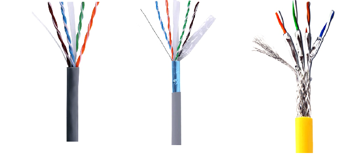

> Cablejat de parells trenats: U/UTP, F/UTP i S/FTP. Atribució: [Optcore](https://www.optcore.net/es/utp-stp-ftp-cable-difference/)

### Fibra òptica

És un tipus de mitjà fet de vidre o plàstic, que utilitza llum per transmetre la informació. No hi ha pèrdues per calor, per tant el senyal pateix menys atenuació. A més, és immune a les interferències i a la diafonia.

En funció de les característiques de la fibra, hi ha dos tipus de propagació: monomode i multimode. La dispersió del feix de llum amb la distància és el factor que afecta a l’abast de les comunicacions.

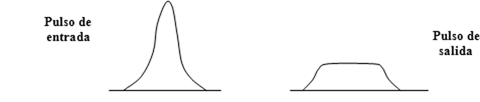

Constructivament, una fibra òptica està formada per tres parts: el nucli, el cladding i la capa de protecció. La llum es propaga pel nucli que té un diàmetre molt petit (uns 9 micròmetres en fibra monomode i uns 50 o 62,5 micròmetres en fibra multimode). El cladding és una capa de vidre amb un índex de refracció inferior al del nucli, que fa que la llum es reflecteixi dins del nucli i que té un diàmetre de 125 micròmetres. La capa de protecció és una capa de plàstic que protegeix la fibra de danys mecànics i ambientals.

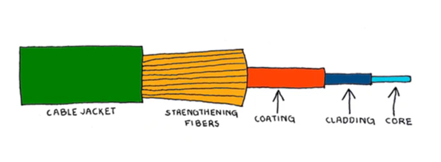

> Estructura fibra òptica. Atribució: [TrueCable](https://www.truecable.com/blogs/cable-academy/fiber-optics-vs-ethernet-understanding-the-key-differences)

En aquest vídeo es pot veure el procés de fabricació d’una fibra òptica i com es transmet la llum pel nucli de la fibra: [Fabricació de fibra òptica](https://youtu.be/0lmLxfIez7Q?feature=shared)

1. **Fibra monomode**: té un nucli molt petit (uns 9 micròmetres) i permet la propagació d’un únic feix de llum. Això fa que la dispersió sigui mínima i que es puguin aconseguir distàncies molt llargues (fins a 100 km o més) amb una gran amplada de banda. Com a font de llum necessita un làser, que és més car i complex que els LEDs utilitzats en fibra multimode.

    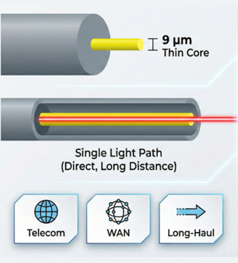
    > Fibra monomode. Atribució: [CRXCONNEC](https://www.crxconec.com)

2. **Fibra multimode**: té un nucli més gran (de 50 o 62,5 micròmetres) i permet la propagació de diversos feixos de llum. Això provoca una major dispersió i limita la distància de transmissió (en xarxes locals per sota del 500 m) i l’amplada de banda. Com a font de llum utilitza LEDs, que són més econòmics i fàcils d’utilitzar que els làsers.

    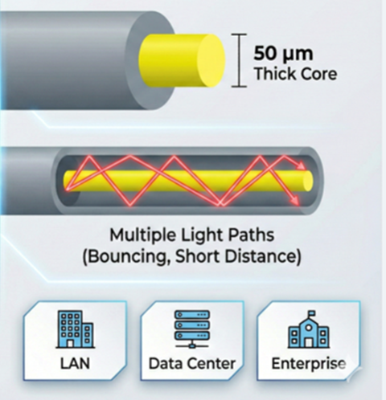
     > Fibra multimode. Atribució: [CRXCONNEC](https://www.crxconec.com)

A les xarxes Ethernet, les fibres òptiques s'usen en mode símplex, per tant, a l'igual que amb els cables de coure, cal un parell de fibres per establir un enllaç. En altres tipus de xarxa, com les d'operadors de telecomunicacions, es poden utilitzar fibres òptiques en mode dúplex, amb un sol cable de fibra que transporta la llum en ambdós sentits.

### Connectors

El connector normalitzat pels cables de parells a xarxes locals és el RJ-45 i el RJ-49 que és la versió apantallada. Existeix el GG-45 amb apantallament per les versions de 10G Ethernet en endavant i és compatible amb endolls RJ-45 (cat. 7 i superiors). Altres connectors com el TERA són molt menys populars.

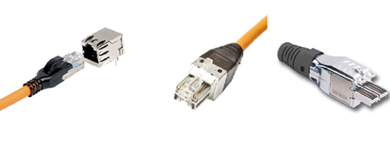

> Connectors RJ-45, GG-45 i TERA. Atribució: [Certificabos](https://www.certificacabos.com.br/single-post/2020/04/07/Cabo-Categoria-7)

En el cas de la fibra òptica, hi ha molta més diversitat de connectors, però el més habituals en xarxes locals són el MTP/MPO, el SC Duplex i el LC.

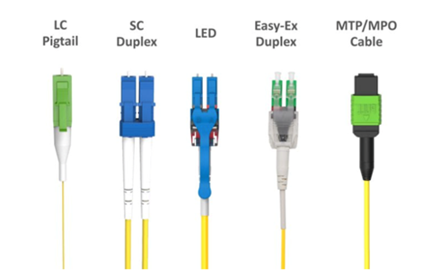

> Connectors fibra òptica. Atribució: [CRCONNEX](https://www.crconnex.com)

### Adaptadors de xarxa (NIC)

Per tal que els equips puguin connectar-se a la xarxa local, necessiten un adaptador de xarxa (NIC, Network Interface Card). Aquest adaptador pot ser intern, disponible a la placa base o una targeta interna que s’instal·la dins del dispositiu o un adaptador extern que es connecta a través d’un port USB, solució típica per exemple per portàtils que no solen incloure targeta de xarxa amb cable.

L'adaptador ha de ser compatible amb el tipus de cablejat i amb la velocitat de transmissió de la xarxa local. Així tindrem adaptadors per coure RJ-45, GG-45 o de fibra òptica amb el connector corresponent.

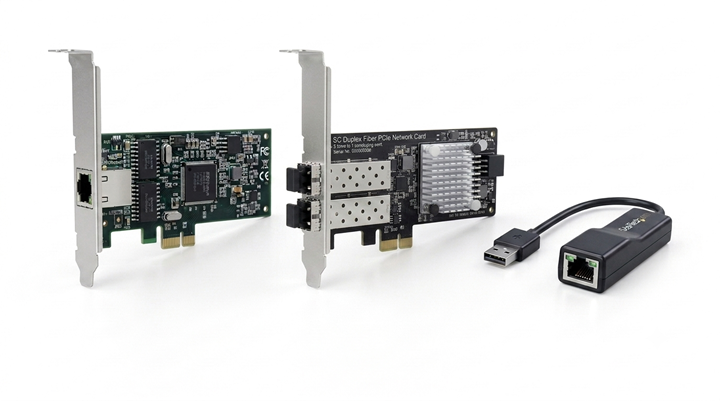

> Adaptadors de xarxa. Atribució: Imatge generada amb Google Gemini.

### Electrònica de xarxa

Són els dispositius que s'encarreguen de gestionar el trànsit de dades a la xarxa local i d'interconnectar els diferents equips.

- El **switch**: és el concentrador de la xarxa local. Rep les dades dels dispositius i les envia només al dispositiu destinatari (usant les adreces MAC). Tots els equips de la xarxa local han d'estar connectats al switch.

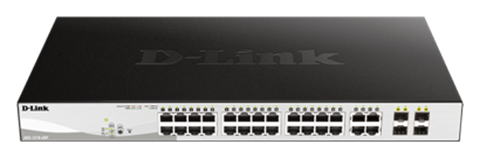

> Switch. Atribució: [D-Link](https://www.dlink.com/es/es/products/dgs-1210-28)

- El **router**: és el dispositiu que permet connectar la xarxa local amb altres xarxes, com ara Internet. El router s'encarrega de dirigir els paquets de dades entre les diferents xarxes i d'assignar adreces IP als dispositius de la xarxa local.

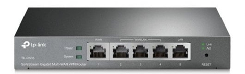

> Router. Atribució: [tp-link](https://www.tp-link.com)

### Elements estructurals

Us imagineu una xarxa local sense cap organització? Els cables estirats per terra, els dispositius apilats sense ordre i sense protecció, etc. Seria un caos i seria molt difícil de mantenir i solucionar problemes.

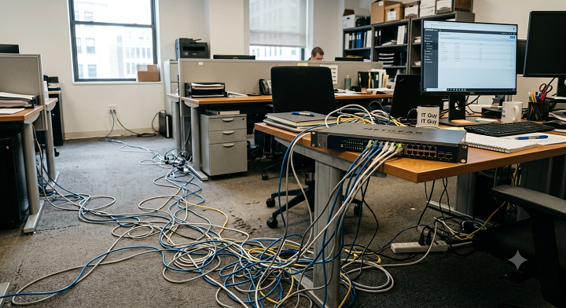

> Exemple de caos a la xarxa local. Atribució: Imatge generada amb Google Gemini.

Per tant, una xarxa local necessita elements estructurals que permetin la distribució i connexió dels dispositius des d'un punt de vista físic. Aquests elements inclouen:

#### Repartidors

Són els armaris o racks on s'instal·len els dispositius de xarxa (switch, router, etc.) i on es connecten els cables de la xarxa local. Això permet una organització i gestió eficient del cablejat i dels dispositius de la xarxa local.

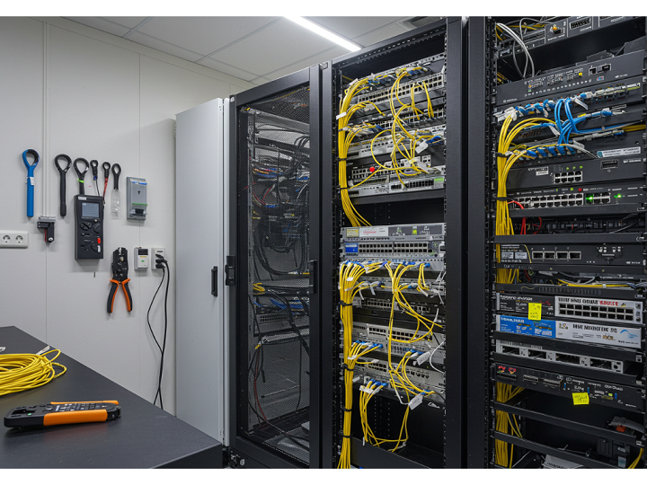

> Repartidors. Atribució: [Cableado Estructurado Perú](https://cableadoestructurado.pe/mantenimiento-y-organizacion-de-racks-claves-para-un-cableado-estructurado-eficiente/)

Poden ser armaris (tancats) o racks (oberts) en funció de les necessitats de seguretat (en sales dedicades és habitual usar racks i quan el distribuidor s'ha d'instal·lar en un lloc accessible a tothom, com ara un despatx, s'usen armaris tancats amb pany).

Les amplades són estàndards, sent la més habitual la de 19” estàndard o 10” (versió estreta). L’alçada es mira en U,s ( 1,75” o 44,45 mm) que és l’alçada mínima d’un element de rack.

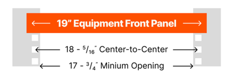

Quant l'alçada, aquesta no s'indica en centímetres, sinó en unitats de rack (U). Cada unitat de rack (1U) té una alçada de 1,75 polzades (44,45 mm). Això permet estandarditzar la mida dels dispositius que s'instal·len en els racks i facilita la seva organització.

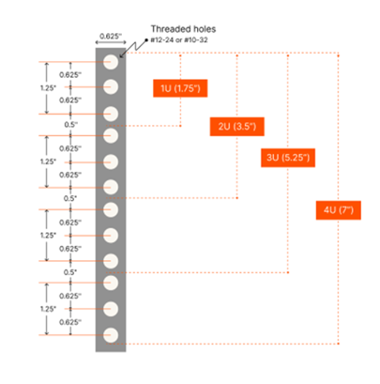

#### Elements d’interconnexió

Als repartidors arribaran els cables provinent dels diferents punts de la xarxa local. Aquests cables s'han de connectar als dispositius de xarxa i per això s'utilitzen elements d'interconnexió com ara panells de connexió (patch panels) o regletes de connexió que es trobaran als repartidors.

Aquests elements intermedis permeten una connexió ordenada i fàcil de gestionar, ja que els cables es poden connectar i desconnectar sense haver de manipular directament els dispositius de xarxa.

Per una correcta organització, conjuntament amb els panells, es disposaran passacables i guies de cablejat que permeten mantenir els cables ordenats i protegits.

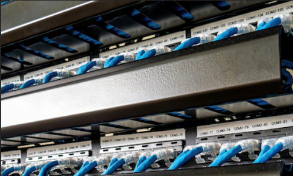

> Panell de connexió. Atribució: [Eziblank](https://eziblank.com/blog/2022/11/29/patch-panel-what-it-is-and-why-your-data-center-needs-it/)

#### Conductes pel cablejat

Ja us podeu imaginar que una xarxa els cables no poden anar per qualsevol lloc (enganxats per la paret, tirats a sobre les plaques del fals sostre, etc.), sinó que han d'estar protegits i organitzats. Per això s'utilitzen conduccions aèries, de superfície (parets) o subterrànies (terre tècnic).

Aquests conductes permeten una instal·lació segura i ordenada del cablejat, evitant danys als cables i facilitant el manteniment de la xarxa local.

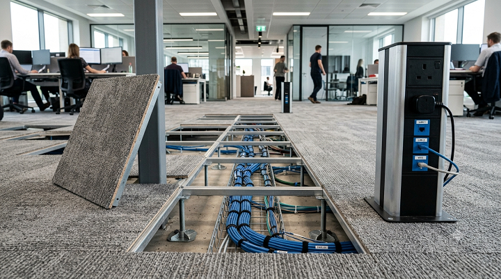

> Conductes pel cablejat. Atribució: Imatge generada amb Google Gemini.

Els tipus de conduccions més habituals són:

- **Safates de cablejat**: són safates metàl·liques o de plàstic que es poden instal·lar pel sostre, per sota el terre tècnic o per les parets. Són la solució habitual quan el volum de cables és gran. Permet una bona organització dels cables, facilitant l'accés.

- **Canaletes**: són conductes de plàstic que es poden instal·lar a les parets o mobiliari. Són una bona solució per distribuir el cablejat fins els llocs de treball.

- **Tubs**: solució similar a la que s'utilitza per les instal·lacions elèctriques o de comunicacions a l'àmbit domèstic. Habitualent tub corrugat de plàstic per la seve flexibilitat, tot i que per conduccions verticals amb molt de cablejat es poden usar tubs rígids. És la solució típica per entorns domèstics o petits despatxos, on el volum de cablejat és reduït i es vol mantenir la instal·lació encastada. Es perd força flexibilitat, perquè els canvis són més complexos.
