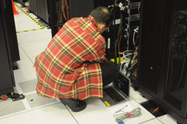
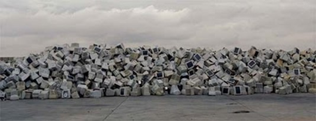

# UD4. Seguretat i protecció mediambiental

RA6. Compleix les normes de prevenció de riscos laborals i de protecció ambiental, identificant els riscos associats, les mesures i equips per a prevenir-los.

## Introducció

El risc laboral és qualsevol situació en què hi hagi la possibilitat “que un treballador pateixi un determinat dany derivat del treball” (Llei 31/1995 de Prevenció de Riscos Laborals).

Els riscos donen lloc a accidents, les repercussions afecten: el propi treballador, la seva família, l'empresa i la societat. Abans d’iniciar una activitat laboral, s’han d’analitzar els riscos per eliminar-los (o minimitzar-los tant com sigui possible).

Per una altra banda, les activitats relacionades amb la instal·lació i manteniment de xarxes locals generen residus. Aquests residus poden contaminar el medi ambient, per tant, s'ha de gestionar correctament.

## Riscos laborals

Al mòdul IPO-I (Itinerari Personal per a l'Ocupabilitat I) s'estudia amb detall la normativa relacionada amb la prevenció de riscos laborals. En aquest mòdul només es farà un repàs dels riscos més habituals en el treball amb xarxes locals.

Els riscos laborals associats a la instal·lació i manteniment de xarxes locals són:

- Caigudes des d'alçada.
- Ensopegades i relliscades.
- Caiguda d'objectes, eines o materials.
- Cops amb objectes o eines.
- Talls.
- Projecció de partícules o fragments.
- Descàrregues elèctriques.
- Exposició a fonts òptiques.
- Postures de treball forçades o manteniment de postures estàtiques.

> Exemple postura forçada. Atribució: [Chiara Coetzee via Flickr](https://www.flickr.com/photos/dcoetzee/6271158853)

### Mesures de prevenció

- Conèixer ubicació i funcionament dels elements de seguretat (extintors, sortides d'emergència, etc.).
- Ordre i neteja.
- Seguir procediments treball amb electricitat i cablejat.
- Ús elements protecció individual (EPI): guants, ulleres protecció (important quan es treballa amb FO).
- Usar les eines idònies i de forma adequada.
- Respectar les zones de pas.
- Ús elements seguretat en treball en alçades.
- Senyalitzar correctament les zones de treball.
- Ús correcte escales.
- Evitar postures forçades i repetitives.
- Realitzar pauses i descansos.

> Cartells mesures de prevenció. Atribució: [Victor House Publications on Safety World](https://simpsonswiki.com/wiki/The_Simpsons_Safety_Posters)

## Gestió de residus

Un cop finalitza la vida útil d’un equipament informàtic cal gestionar-los adequadament:

- Reciclatge dels materials que ho siguin.
- Tractament residus contaminants.

La gestió dels residus informàtics s’ha de realitzar en lloc autoritzats:

- Deixalleries
- Gestors Autoritzat

En el punt de gestió es realitzarà la separació dels diferents components dels dispositius.

I quines accions concretes es poden fer des del lloc de treball?

- Prevenir la generació de residus: imprimir només quan sigui necessari, reutilitzar envasos, etc.
- Reutilització de materials: reutilitzar paper, cartró, sobrants de cablejat, etc.
- Retirada de residus: dipositar els residus en els contenidors corresponents, no llençar-los a la brossa general.
