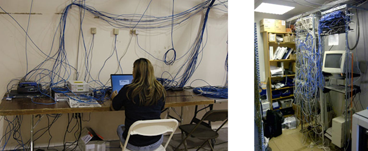
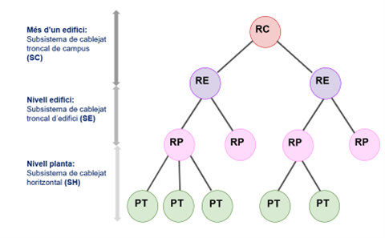
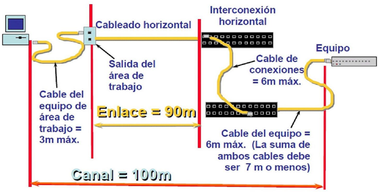

# UD5. Instal·lació física de la xarxa: cablatge estructurat

RA2. Desplega el cablejat d'una xarxa local interpretant-ne especificacions i aplicant-hi tècniques de muntatge.

RA3. Interconnecta equips en xarxes locals cablejades descrivint estàndards de cablejat i aplicant tècniques de muntatge de connectors.

## Introducció

La xarxa local cablejada és un element vital per a qualsevol organització que usi ordinadors per la seva activitat. Una instal·lació adequada assegura un bon funcionament i un manteniment senzill.

> Exemples de cablejat mal estructurat. Atribució: desconeguda

Per evitar aquests problemes, apareix la idea del **cablatge estructurat**, que és el mètode sistemàtic emprat per realitzar la instal·lació de la infraestructura de xarxa en una oficina, edifici, etc.

## Objectius del cablatge estructurat

- Establir criteris per a la instal·lació.
- Proporcionar independència front les tecnologies dels sistemes que es connecten, fabricants i components.
- Permetre ampliacions i modificacions futures del sistema.
- Facilitar la localització de les avaries.

## Normatives

Evidentment si es tracta d'un mètode sistemàtic, cal establir unes normes que regulin la instal·lació.Aquestes normes són les **normatives de cablatge estructurat**, existeixen diverses, en funció del tipus de cablejat i de la zona geogràfica. Les més conegudes són:

- **ISO/IEC 11801**: Normativa internacional que defineix els requisits de rendiment per a sistemes de cablejat genèrics.
- **EN 50173**: Normativa europea que defineix els requisits de rendiment per a sistemes de cablejat genèrics.
- **ANSI/TIA-568**: Normativa nord-americana que defineix els requisits de rendiment per a sistemes de cablejat genèrics.

Les normes especifiquen diversos aspectes de la instal·lació:

- La topologia de la xarxa.
- Requisits de components.
- Els tipus de cablejat permesos.
- Limitacions de distàncies de cablejat.
- Configuració de les preses/connectors.
- Proves de funcionament (certificació).

## Categories i classes de cablejat

Les normes defineixen diverses categories i classes. Serveixen per classificar els components físics: cables, connectors, panells, etc., en funció de les seves característiques i prestacions.

A les normes americanes EIA/TI s’usa el concepte de categoria, mentre que les normes europees parlen del concepte de classe, però òbviament són equivalents a efectes pràctics, sent més habitual treballar amb el concepte de categoria a l'hora de selecionar els components i amb el concepte de classe a l'hora de certificar la instal·lació amb normativa europea.

> 💡La principal diferència entre categoria i classe, és que la categoria fa referència a les prestacions de cada component, mentre que la classe mesura les prestacions de la instal·lació ja muntada.

Les categories més habituals en l'actualitat:

| Categoria | Amplada de Banda | Velocitat Màxima | Aplicació Típica |
| --- | --- | --- | --- |
| **Categoria 5e (Cat 5e)** | 100 MHz | 1 Gbps (1000BASE-T) | Obsoleta |
| **Categoria 6 (Cat 6)** | 250 MHz | 1 Gbps (fins a 100 m) / 10 Gbps (fins a 55 m) | Xarxes domèstiques i petites oficines. |
| **Categoria 6A (Cat 6A)** | 500 MHz | **10 Gbps** (10GBASE-T) | **Estàndard professional** per a noves instal·lacions. |
| **Categoria 7 (Cat 7)** | 600 MHz | 10 Gbps | Instal·lacions amb alt blindatge (S/FTP), molt poc habitual. |
| **Categoria 7A (Cat 7A)** | 1000 MHz | 10 Gbps | Ús en entorns especialitzats amb requeriments de 1 GHz molt poc habitual (no USA). |
| **Categoria 8 (Cat 8)** | 2000 MHz | 40 Gbps (40GBASE-T) | Exclusiu per a **centres de dades** i connexions d'alta velocitat de curta distància (fins a 30m). |

A tall d'exemple, les classes més habituals segons la normativa europea són:

- Classe E: Equival a Cat 6.
- Classe EA: Equival a Cat 6A.

En el cas de la fibra òptica, enlloc de parlar de categoria, es parla de tipus, però tenint clar que és un concepte equivalent. Els tipus més habituals són:

- **OM3**: Fibra multimode amb nucli de 50 μm. Permet velocitats de fins a 10 Gbps a 300 m.
- **OM4** i **OM5**: Fibra multimode amb nucli de 50 μm. Permeten velocitats de fins 100 Gbps a 150 m i es reserven per a aplicacions de data center.
- **OS2**: Fibra monomode amb nucli de 9 μm. Permet velocitats de fins a 100 Gbps a 10 km.

## Subsistemes de cablatge estructurat

El model de cablatge estructurat es divideix en subsistemes, cadascun dels quals té una funció específica com es mostra a la imatge.

- El **subsistema vertical** està format per tots els elements necessaris per enllaçar els distribuïdors de planta d’un edifici i si tenim una xarxa d’edificis, també els distribuïdors de cada edifici amb el distribuïdor principal o de Campus.

- El **subsistema de cablatge horitzontal** està format per tots els elements que permeten la connexió dels llocs de treball al distribuïdor de planta.

## Elements del cablatge estructurat

- **Repartidors**: Armaris amb panells de connexió i elements actius (routers, switchs..) d’on parteixen els cables que formen el cablejat de cada subsistema.

- **Cablejat**:
  - **Cablejat vertical**: Cables que connecten els distribuïdors de planta amb el distribuïdor principal o si és el cas, els repartidors d'edifici amb el repartidor de campus.
  - **Cablejat horitzontal**: Cables que connecten els llocs de treball amb el distribuïdor de planta.

- **Punts de treball**: Són els punts on es connecten els equips de l’usuari final. Normalment són preses de xarxa RJ-45, que tant poden servir per a connexió de dades com de veu.

### Cablejat horitzontal

Des del RP ha d’anar un cable per cada presa de treball (enllaç exclusiu). Aquest cable ha d’estar format per un parell de cables UTP o FTP, amb un mínim de 4 parells, i amb una categoria mínima Cat 6, recomanant-se actualment Cat 6A. La longitud màxima de l'enllaç (de la presa al panell del repartidor) és de 90 m, sent 100 m la longitud màxima total de l’enllaç, incloent-hi els tirantets o patchcords entre la presa i l'equip i entre el panell i l'equip actiu del repartidor (switch).

### Cablejat vertical o troncal

Serveix per unir els repartidors de planta (RP) amb el repartidor d’edifici (RE), s'utilitza Fibra òptica (OM3 o OM4) per dades i cable de categoria 3 (telefònic) per telefonia convencional, tot i que cada cop és més habitual usar únicament enllaços de fibra òptica a l'usar telefonia per IP (VoIP).

A diferència del cablejat horitzontal, aquí els enllaços no són exclusius, sinó que es comparteixen entre diversos punts de treball, típicament un enllaç de fibre per cada 24 preses de treball.

## Distribució del cablejat

El cablejat obligatòriament s’ha de distribuir per canalitzacions:

- Tub corrugat: per instal·lacions encastades.
- Canaletes: típiques per distribuir per superfície (parets), habitualment de plàstic o alumini.
- Safates: metàl·liques o de plàstic. Se solen usar en la distribució per sostre o per terra tècnic.

Aquestes canalitzacions poden anar per les parets (encastades o per superfície), pel sostre (sostre tècnic) o pel terra (terra tècnic). En qualsevol cas, s’ha de procurar que el recorregut sigui el més curt possible, però de forma longitudinal o transversal a la superfície, evitant corbes i girs bruscos.

A més, cal evitar les interferències electromagnètiques, per la qual cosa s’ha de procurar que el cablejat no passi a prop de fonts d’interferència com ara motors, fluorescents, transformadors, etc. i en el cas de les pròpies canalitzacions, s'ha de separar el cablejat de dades del cablejat elèctric, almenys fins els darrers 15 m. abans arribar a la presa de treball.
