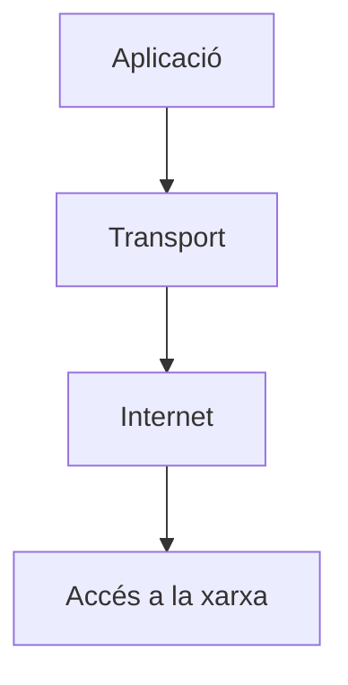
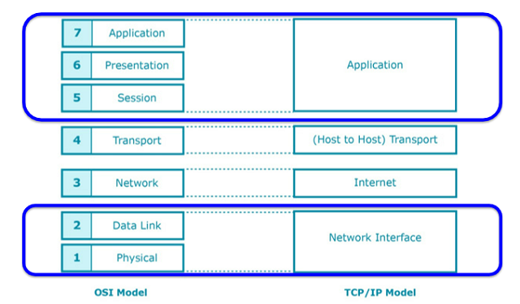

# UD6. Pila de protocols TCP/IP

RA4. Instal·la equips en xarxa, descrivint-ne les prestacions i aplicant tècniques de muntatge.

## Introducció

Arquitectura de protocols desenvolupada per V. Cerf i R. Khan per la xarxa ARPANET (antecedent d’Internet). Agafa el nom dels dos protocols més importants que utilitza (TCP i IP).

S'ha convertit en un estàndard de facto, totes les xarxes locals segueixen aquest model per connectar-se a Internet.

La pila TCP/IP ofereix comunicació entre serveis utilitzant xarxes físiques heterogènies. Internet és l’exemple més clar de xarxa TCP/IP, permet connectar equips separats geogràficament independentment de la tecnologia de xarxa on estiguin connectats (WiFi, Ethernet, PPP...).

## Arquitectura de la pila TCP/IP

Com pràcticament totes les arquitectures, és un model en capes, on cada capa té una funció concreta i ofereix serveis a la capa superior. La pila TCP/IP té quatre capes:

Si recordeu, el model OSI de referència té 7 capes, mentre que la pila TCP/IP només en té 4. Això és degut a que algunes de les capes del model OSI s’han agrupat en una sola capa a la pila TCP/IP, bàsicament perquè s'agrupen pel component hardware o sofware que les implementa.

Ara veurem breument les funcions de cada capa de la pila TCP/IP i quines capes del model OSI corresponen.

- **Network Access Layer (Capa d’accés a la xarxa)**

    Aquesta capa agrupa les capes 1 i 2 del model OSI (Física i Enllaç de dades). La seva funció és la de transmetre paquets de dades a través d’una xarxa física. Aquesta capa depèn del tipus de xarxa que s’utilitzi, ja que cada tecnologia té el seu propi protocol per transmetre dades i bàsicament s'implementa en el hardware de l'adaptador de xarxa.

    Algunes de les tecnologies més utilitzades són: Ethernet, WiFi, PPP, FDDI, Token Ring, etc. Cada tecnologia té el seu propi protocol per transmetre dades, però totes elles tenen en comú que utilitzen adreces MAC per identificar els dispositius de la xarxa.

- **Internet Layer (Capa d’Internet)**

    Aquesta capa és equivalent a la capa de Xarxa del model OSI. La seva funció és la de transmetre paquets de dades entre dispositius que poden estar en xarxes diferents.

    Per tant, aquesta capa és la que permet el funcionament d’Internet, ja que permet que els paquets de dades arribin al dispositiu correcte independentment de la xarxa on estigui connectat. En aquesta capa s'usa l'adreça IP per identificar els dispositius de la xarxa.

- **Transport Layer (Capa de Transport)**

    Quan parlem amb una persona pel telèfon mòbil, la nostra comunicació és directa, com si els dos telèfons estiguessin connectats directament, tot i que realment, per sota, la comunicació passa per diverses etapes (centrals telefòniques, repetidors, etc.).

    Doncs bé, la capa de transport s'encarrega de gestionar la comunicació directa entre els dos dispositius que volen comunicar-se, independentment de la xarxa que hi hagi entre ells.

- **Application Layer (Capa d’Aplicació)**

    Al final usem els ordinadors mitjançant aplicacions, com ara navegadors web, clients de correu electrònic, etc. La capa d’aplicació és la que ofereix els serveis necessaris per a que les aplicacions puguin comunicar-se entre elles.

    Aquesta capa és equivalent a les capes 5, 6 i 7 del model OSI (Sessió, Presentació i Aplicació), perquè  les funcions d’aquestes capes s’implementen en el software de les aplicacions.

    Alguns exemples de protocols d'aquesta capa són: HTTP (responsable dels serveis web), FTP (responsable de la transferència de fitxers), SMTP (responsable del correu electrònic), DNS (responsable de la resolució de noms de domini).

## Internet Layer (Capa d’Internet)

Com s'ha dit abans, la funció d'aquesta capa és la de transmetre paquets de dades entre dispositius que poden estar en xarxes diferents, aquesta capa és gestionada bàsicament per tres protocols:

- Protocol IP (Internet Protocol) que és el protocol principal d’aquesta capa, s’encarrega de l’adreçament i encaminament dels paquets de dades.

- Protocol ICMP (Internet Control Message Protocol) que s’encarrega de la gestió d’errors i control de la xarxa.

- Protocol ARP (Address Resolution Protocol) que s’encarrega de resoldre les adreces IP en adreces MAC, actuan d'inferfície amb la capa d'accés a la xarxa.

La unitat d'informació d'aquesta capa (PDU) és el **datagrama**, que és un paquet de dades que conté una capçalera amb informació de control i una càrrega útil amb les dades que es volen transmetre. La capçalera del datagrama IP conté informació com l'adreça IP d'origen i destinació, el tipus de protocol de la capa superior, la longitud del datagrama, etc.

Les característiques principals de la transmsissió de dades en aquesta capa són:

- **Sense connexió**: Abans d'enviar un datagrama, no es comprova si el dispositiu de destinació està disponible o no. Simplement s'envia el datagrama i es confia que arribarà a la seva destinació.

- **No fiable**: No hi ha cap mecanisme de control d'errors ni de confirmació de recepció. Si un datagrama es perd o es corromp, qui ho envia no en té constància.

- **Sense estat**: No es manté cap informació sobre l'estat de la connexió entre els dispositius. Cada datagrama és independent dels altres i, per tant, el seu enviament es tracta de forma individual.

>💡 Les comunicacions clàssiques com el telèfon, el teletip, etc. funcionen calculen la ruta a l'inici de la transmissió i mantenint-la per tot els "paquets" a enviar. És un sistema ràpid i eficient, però que té un problema, si les condicions canvien (el camí es talla), es perd la transmissió. El protocol IP es va crear sense estat perquè un dels criteris de disseny d'ARPANET era que fos una xarxa capaç de mantenir les comunicacions encara que es produissin fallades en alguns dels seus nodes.

Ara veurem alguns dels aspectes més importants d'aquesta capa com:

- Adreçament IP.
- Classless Inter-Domain Routing (CIDR).
- ARP (Address Resolution Protocol).
- IP Routing.
- NAT (Network Address Translation).

### Adreçament IP

A la capa d'accés a la xarxa, els dispositius s'identifiquen mitjançant l'adreça MAC, que és un identificador únic i que depèn del fabricant de l'adaptador de xarxa.

A la capa d'Internet, cal comunicar xarxes diferents i per tant, l'adreça MAC no és viable, perquè hauríem de tenir localitzades totes les adreces connectades al món, per aquest motiu, necessitem un format d'adreça que permeti agrupar jeràrquicament els dispositius per xarxes, de forma similar a com es fa amb els números de telèfon, aquestes són les **adreces IP**.

>💡 Us heu plantejat mai format té un número de telèfon fixe? Per exemple, pensem un telèfon de Mataró, 34937556159. Aquest número, es pot descomposar en els 2 primers dígits (34) que identifiquen el país, el 93 correspon a la província, els 75 correspon a la zona o central telefònica, en aquest cas correspon a una de Mataró, sent la resta de dígits els que identifiquen la línia de l'abonat.

D'adreces IP actualment n'hi ha dues versions, que corresponen a les dues versions operatives del protocol IP, la versió 4 (IPv4) corresponen a la primer versió funcional d'ARPANET i la versió 6 (IPv6), que va néixer per solucionar el problema d'esgotament d'adreces IP de la versió 4.

### Adreçament IPv4

La versió 4 del protocol IP utilitza adreces de 32 bits (en aquell moment era el límit de representació de dades que es podia utilitzar), d'aquesta manera es poden representar 2^32 adreces diferents, que són 4.294.967.296 adreces, que tot i que semblen moltes, ja fa anys que n'hi ha problemes d'esgotament.

Es representen en format decimal amb 4 octets separats per punts, per exemple:

192.168.1.3

Al principi, les adreces IP es van classificar en classes, que era un forma senzilla de determinar la mida de la xarxa.
