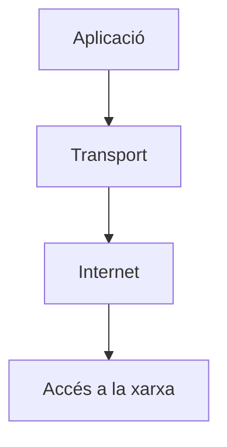

# UD6. Pila de protocols TCP/IP

RA4. Instal·la equips en xarxa, descrivint-ne les prestacions i aplicant tècniques de muntatge.

## Introducció

Arquitectura de protocols desenvolupada per V. Cerf i R. Khan per la xarxa ARPANET (antecedent d’Internet). Agafa el nom dels dos protocols més importants que utilitza (TCP i IP).

S'ha convertit en un estàndard de facto, totes les xarxes locals segueixen aquest model per connectar-se a Internet.

La pila TCP/IP ofereix comunicació entre serveis utilitzant xarxes físiques heterogènies. Internet és l’exemple més clar de xarxa TCP/IP, permet connectar equips separats geogràficament independentment de la tecnologia de xarxa on estiguin connectats (WiFi, Ethernet, PPP...).

## Arquitectura de la pila TCP/IP

Com pràcticament totes les arquitectures, és un model en capes, on cada capa té una funció concreta i ofereix serveis a la capa superior. La pila TCP/IP té quatre capes:



Si recordeu, el model OSI de referència té 7 capes, mentre que la pila TCP/IP només en té 4. Això és degut a que algunes de les capes del model OSI s’han agrupat en una sola capa a la pila TCP/IP, bàsicament perquè s'agrupen pel component hardware o software que les implementa.


Ara veurem breument les funcions de cada capa de la pila TCP/IP i quines capes del model OSI corresponen.

## Network Access Layer (Capa d’accés a la xarxa)

 Aquesta capa agrupa les capes 1 i 2 del model OSI (Física i Enllaç de dades). La seva funció és la de transmetre paquets de dades a través d’una xarxa física. Aquesta capa depèn del tipus de xarxa que s’utilitzi, ja que cada tecnologia té el seu propi protocol per transmetre dades i bàsicament s'implementa en el hardware de l'adaptador de xarxa.

 Algunes de les tecnologies més utilitzades són: Ethernet, WiFi, PPP, FDDI, Token Ring, etc. Cada tecnologia té el seu propi protocol per transmetre dades, però totes elles tenen en comú que utilitzen adreces MAC per identificar els dispositius de la xarxa.

## Internet Layer (Capa d’Internet)

Aquesta capa és equivalent a la capa de Xarxa del model OSI. La seva funció és la de transmetre paquets de dades entre dispositius que poden estar en xarxes diferents.

Per tant, aquesta capa és la que permet el funcionament d’Internet, ja que permet que els paquets de dades arribin al dispositiu correcte independentment de la xarxa on estigui connectat. En aquesta capa s'usa l'adreça IP per identificar els dispositius de la xarxa.

Aquí el protocol estrella és l’IP (Internet Protocol), que és el protocol que s’encarrega de transmetre els paquets de dades entre dispositius. També hi ha altres protocols com ICMP (Internet Control Message Protocol) i ARP (Address Resolution Protocol).

Aquesta capa incorpora l'adreça IP, que és l'adreça que permet identificar un dispositiu a Internet.

## Transport Layer (Capa de Transport)

Quan parlem amb una persona pel telèfon mòbil, la nostra comunicació és directa, com si els dos telèfons estiguessin connectats directament, tot i que realment, per sota, la comunicació passa per diverses etapes (centrals telefòniques, repetidors, etc.).

Doncs bé, la capa de transport s'encarrega de gestionar la comunicació directa entre els dos dispositius que volen comunicar-se, independentment de la xarxa que hi hagi entre ells.

Els protocols que s’utilitzen en aquesta capa són TCP (Transmission Control Protocol) i UDP (User Datagram Protocol).

La informació de capçalera que s'afegeix en aquesta capa és el **port**.

### Els ports de la capa de transport

Són números que identifiquen els serveis que s’executen en un dispositiu. Per exemple, el port 80 és el port que s’utilitza per al servei web HTTP, mentre que el port 443 és el port que s’utilitza per al servei web HTTPS.

Per entendre fàcilment la utilitat dels ports, pensem en un repartidor que ha de portar un paquet a una persona que hi viu en un edifici d'apartaments. En primer lloc necessita saber el carrer i el número de l'edifici. Però un cop, hi arriba, necessita saber el número d'apartament per poder lliurar el paquet a la persona correcta. Doncs bé, l'adreça IP és com el carrer i el número de l'edifici (xarxa i hosts), mentre que el port (identificador de l'aplicació o procés) és com el número d'apartament.

Aquest número identificatiu té 16 bits, per tant, el rang de ports és de 0 a 65535. Els ports es classifiquen en tres categories:

- **Ports coneguts (Well-known ports)**: del 0 al 1023. Són utilitzats per serveis estandarditzats (els protocols fonamentals de xarxes i Internet), com ara el port 80 per al servei web HTTP o el port 443 per al servei web HTTPS. Estan normalitzats per l’IANA (Internet Assigned Numbers Authority) i no s'haurien d'utilitzar per a serveis que no estiguin registrats, perquè poden entrar en conflicte amb serveis coneguts.

- **Ports registrats (Registered ports)**: del 1024 al 49151. Són els ports que utilitzen aplicacions i que sol·liciten a la IANA que els registri per evitar conflictes amb altres aplicacions. Per exemple, el port 3306 és el port que utilitza MySQL.

- **Ports dinàmics o privats (Dynamic or Private ports)**: del 49152 al 65535. Són ports no registrats i que poden ser utilitzats per qualsevol aplicació. També sol ser el marge de ports que usen els clients per establir connexions amb els servidors, ja que el client no necessita un port fix per comunicar-se amb el servidor, se'n diu port efímer i té l'avantatge que un mateix client pot establir diverses connexions amb un mateix servidor, ja que cada connexió utilitza un port diferent.

Per tant, una comunicació de xarxa entre dos dispositius es pot identificar amb la següent informació:

- Adreça IP del dispositiu origen
- Port del dispositiu origen
- Adreça IP del dispositiu destí
- Port del dispositiu destí

A la combinació d’adreça IP i port se l’anomena **socket**. Per exemple, si un client amb adreça IP 192.168.1.100 utilitza el port 54321 per enviar dades a un servidor amb adreça IP 10.0.0.1 i port 8080, la comunicació es pot identificar amb el socket:

```text
192.168.1.100:54321 -> 10.0.0.1:8080
```

### TCP vs UDP

1. **Protocol TCP**

TCP és un protocol orientat a connexió, que garanteix que els paquets de dades arribin a destí i en l’ordre correcte.

- Orientat a connexió: abans de començar a enviar dades, s’estableix una connexió entre els dos dispositius que volen comunicar-se. Aquesta connexió es manté durant tota la comunicació i es tanca quan s’acaba. S'utilitza un procés anomenat "three-way handshake" per establir la connexió.

- Fiabilitat: TCP garanteix que els paquets de dades arribin a destí. Si algun paquet es perd, TCP s’encarrega de tornar-lo a enviar.

- Control de flux: TCP s'encarrega de controlar l'ordre dels paquets, a l'enviar els paquets es numeren i a recepció, s'ordenen abans de ser processats.

2.**Protocol UDP**

UDP (User Datagram Protocol) és un protocol sense connexió, que no garanteix la fiabilitat de la transmissió, però és més ràpid que TCP.

UDP envia datagrames sense establir connexió, sense confirmació i sense ordre. Usa una capçalera fixa de 8 bytes.

Analogia de la ràdio: TCP és un correu certificat (signa el carter, el paquet torna si no arriba); UDP és un megàfon (emets i segueixes, encara que algú no t’escolti).

Casos típics de UDP:

- Streaming i VoIP: millor perdre un paquet que congelar la trucada. S'usen algoritmes amb correcció d'errors per reconstruir la informació perduda.
- Jocs online: la rapidesa és vital, i si es perd un paquet, el següent ja porta la informació actualitzada.

3.**Resum**

- TCP garanteix lliurament i ordre mitjançant handshake, numeració de segments i ACKs.
- UDP és lleuger i sense connexió: perfecte per a temps real.

Cal triar segons la prioritat: dades íntegres (TCP) o fluïdesa (UDP).

## Application Layer (Capa d’Aplicació)

Al final usem els ordinadors mitjançant aplicacions, com ara navegadors web, clients de correu electrònic, etc. La capa d’aplicació és la que ofereix els serveis necessaris per a que les aplicacions puguin comunicar-se entre elles.

Aquesta capa és equivalent a les capes 5, 6 i 7 del model OSI (Sessió, Presentació i Aplicació), perquè  les funcions d’aquestes capes s’implementen en el software de les aplicacions.

Alguns exemples de protocols d'aquesta capa són: HTTP (responsable dels serveis web), FTP (responsable de la transferència de fitxers), SMTP (responsable del correu electrònic), DNS (responsable de la resolució de noms de domini).

## Encapsulament de dades

Vegem un exemple senzill, on es comença amb una petició HTTP (GET /index.html) i es va encapsulant a mesura que passa per les diferents capes de la pila TCP/IP.

```data
[Dades d'aplicació]           ← Capa 7 (HTTP: "GET /index.html")
     ↓
[TCP | Dades]                   ← Capa 4 (afegeix ports, seq, ack) → SEGMENT
     ↓
[IP | TCP | Dades]              ← Capa 3 (afegeix IPs origen/destí) → PAQUET
     ↓
[Ethernet | IP | TCP | Dades | FCS]  ← Capa 2 (afegeix MACs + CRC) → TRAMA
     ↓
[1011010010111010...]           ← Capa 1 (bits en el cable)
```

🎯 Punts clau:

- Cada capa afegeix informació, mai la treu (excepte a destí).
- El contingut viatja “protegit” de dins cap a fora: el que és “dades” per una capa és només el payload de la capa inferior.
- Els encapçalaments no es modifiquen en ruta, excepte camps concrets (p. ex. el TTL de l’IP, que decreix router a router).

Al destí, cada capa treu la seva capçalera i passa el contingut a la capa superior:

```data
Bits → Capa 1: reconstrueix la trama
     → Capa 2: treu Ethernet, comprova l'FCS → queda el PAQUET IP
     → Capa 3: treu IP, comprova el checksum → queda el SEGMENT TCP
     → Capa 4: treu TCP, ordena els segments → queden les DADES
     → Capa 7: el navegador interpreta el GET
```
