# UD8. Commutadors de xarxa local

RA4. Instal·la equips en xarxa, descrivint-ne les prestacions i aplicant tècniques de muntatge.

## Introducció

Les xarxes locals cablejades, segueixen una topologia en estrella, on tots els equips estan connectats a un dispositiu central anomenat **commutador**. Aquest dispositiu és el que permet que els equips es comuniquin entre ells i amb altres xarxes.

## Funcionament del switch

El switch s'encarrega de rebre els paquets de dades que li arriben per un port i enviar-los al port corresponent on es troba l'equip destinatari. Per fer això, el switch manté una taula d'adreces MAC que li permet saber a quin port està connectat cada dispositiu de la xarxa.

### Domini de Col·lisió vs. Domini de Difusió

- Domini de col·lisió: Segment de xarxa on dos o més dispositius poden enviar dades al mateix temps i provocar una col·lisió. Un switch aïlla els dominis de col·lisió en cada un dels seus ports. Si un switch té 24 ports, crea 24 dominis de col·lisió independents.

-Domini de difusió (Broadcast Domain): Àrea de la xarxa on qualsevol dispositiu pot enviar una trama de broadcast (destinada a FF:FF:FF:FF:FF:FF) i tots els altres dispositius la rebran. Per defecte, tots els ports d'un switch pertanyen al mateix domini de difusió.

> Consell Clau: Els hubs (concentradors vells) tenen 1 sol domini de col·lisió i 1 domini de difusió. Els switches tenen 1 domini de col·lisió per port i 1 domini de difusió per defecte (si no s'usen VLANs).

### 1.2 La Taula d'Adreces MAC (CAM Table)

El switch pren decisions de reenviament consultant la seva **taula d'adreces MAC** (també coneguda com a *Content Addressable Memory* o *CAM Table*). Aquesta taula associa cada port del switch amb l'adreça MAC del dispositiu connectat a ell.

El funcionament de la taula MAC segueix 4 passos fonamentals:

1. **Aprenentatge (*Learning*):** Quan arriba una trama a un port, el switch examina l'**adreça MAC d'origen**. Si aquesta adreça no està a la taula, la guarda associada al port d'entrada juntament amb un temporitzador (*timer*).

2. **Inundació (*Flooding*):** El switch examina l'**adreça MAC de destí**. Si l'adreça de destí és desconeguda (no està a la taula) o és de difusió (*broadcast*), el switch reenvia la trama per **tots els ports excepte el port d'origen**.

3. **Reenviament (*Forwarding*):** Si l'adreça MAC de destí és coneguda i es troba a la taula, el switch reenvia la trama **únicament pel port corresponent**.

4. **Envelliment (*Aging*):** Les entrades de la taula s'eliminen automàticament si no hi ha activitat durant un temps determinat (normalment 300 segons per defecte en equips Cisco).
